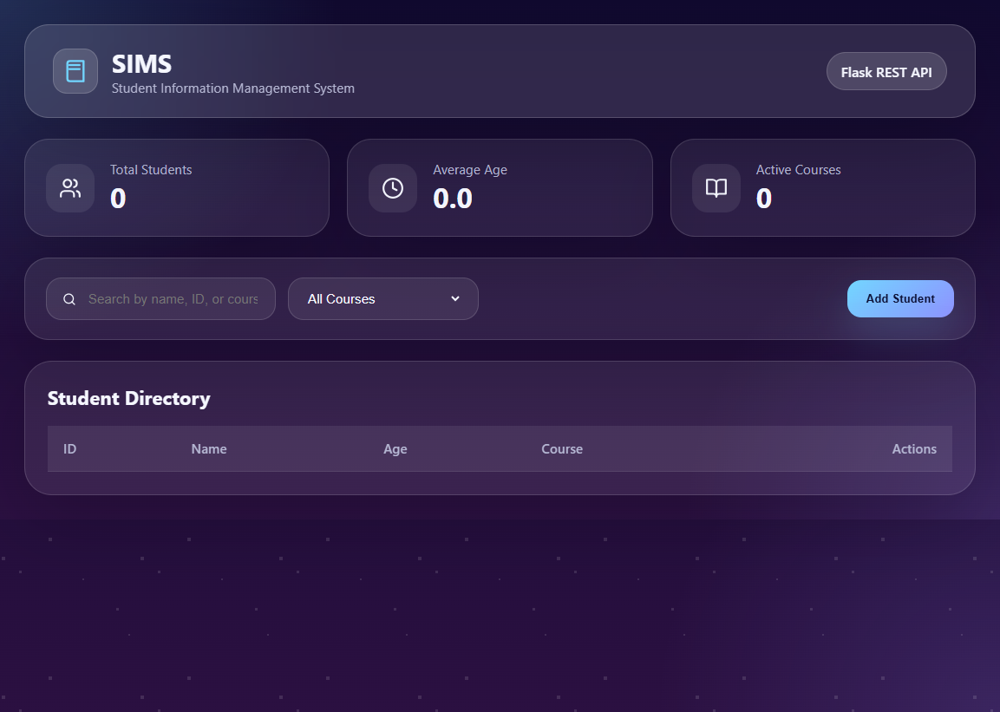

# Student Information System

A complete Flask-based student information system with a REST API and responsive dashboard frontend.

## Features

- Create, read, update, and delete student records
- Search by student name, ID, or course
- Course filter support
- SQLite storage with SQLAlchemy
- Responsive dashboard UI served from `public/`

## Requirements

- Python 3.8+
- Flask
- Flask-SQLAlchemy
- SQLAlchemy

## Install

```bash
pip install -r requirements.txt
```

## Run

```bash
python app.py
```

Open `http://localhost:5000` in your browser.

## Screenshot Example



## GitHub Repository

This project is connected to GitHub at:

https://github.com/samruddhi-kalbande/HACKOWEEK-SEM-5

## API Endpoints

- `GET /api/students` - Get all students
  - Optional query params: `search`, `course`
- `GET /api/students/<id>` - Get a single student
- `POST /api/students` - Create a student
  - JSON body: `{ "id": 1, "name": "Rahul", "age": 20, "course": "CSE" }`
- `PUT /api/students/<id>` - Update student
  - JSON body may include: `name`, `age`, `course`
- `DELETE /api/students/<id>` - Delete student
- `GET /health` - Health check endpoint

## Notes

- The first run creates `students.db` automatically.
- The frontend is served from `public/index.html`.
- You can also call `/students` and `/students/<id>` with the same REST behavior.
